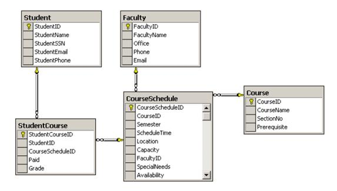
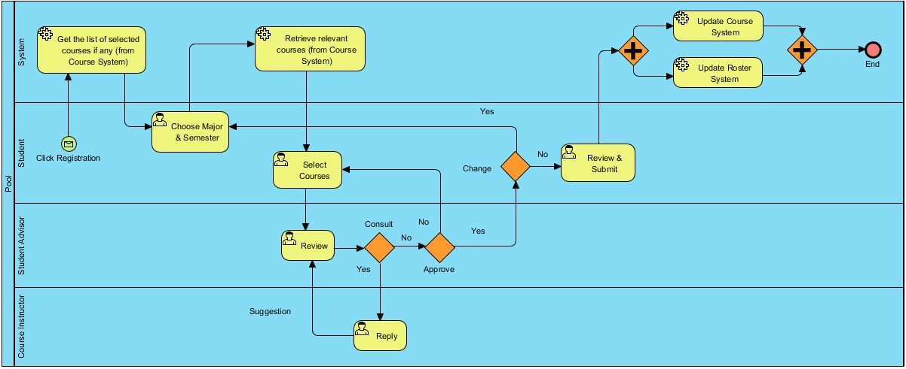

# insc568finalproject
Depends on the needs in your design/implementation, the provided 2 database schemas can be adjusted if necessary. If you would like to implement the project, no connection to real database is needed (i.e., optional). The needed data can be simply hard coded in your APIs.    

    Task 1. Based on the provided project information, design those stated remote APIs (4 in total).
        a. Detailed data should be included in each of those 4 APIs. 
            i. Input 
            ii. Output
        b. How will you implement them? You can actually implement them using any programming language. Or simply you write it up using pseudo codes as you did in Exercise 1.  
    Task 2. Can you implement those 4 APIs at the method-level or the data-level? Or some of them should be implemented at the data-level or the method-level? Why or why not?
        a. Get the list of selected courses from Course System,
        b. Retrieve relevant courses information from Course System, 
        c. Update Course System with the selected courses information, 
        d. Update Roster System with the selected courses information.
    Task 3. Discussions
        a. Should an ESB be adopted in this project, in the short term or in the long run?  Why or why not?
        b. The benefits of adopting BPM in this project.

